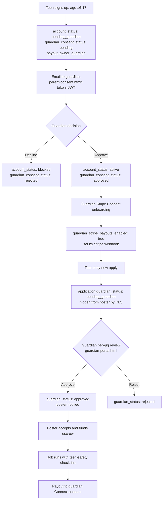

# QuickGigs — Under-18 (16–17) Account Model

**Last verified:** 13 Sep 2026 against live schema and `main`.
**Scope:** How teen accounts work end to end — signup, guardian consent, payouts, gates, graduation, and safety.

A "teen" is **16 or 17**. Under 16 cannot register at all. At 18 an account graduates automatically.

Every claim below cites `file:line`. When code and user-facing copy disagree, **the code is what happens** — see [Known contradictions](#known-contradictions).

---

## The short version

A teen signs up as a **tasker only** (never a poster). Their account is frozen at `pending_guardian` until a guardian does **two separate things**:

1. **Approves the account** via an emailed one-time link.
2. **Completes Stripe Connect payout setup** as the adult who receives the money.

Both are required before the teen can apply to anything. After that, **each individual application** also needs guardian approval before the poster can see it.

So there are three gates, not one: account consent, guardian payout setup, and per-gig approval.

---

## Lifecycle

---

## 1. Signup

The date-of-birth step is a scroll-wheel picker (`signup.html:146-166`). Age is computed by `calcAge` (`qg-onboarding.js:11-17`); under 16 is blocked with a toast (`qg-onboarding.js:291-297`). A user aged 16–17 is flagged `isTeen` (`qg-onboarding.js:339-341`), which unhides the guardian step — **step 6 of 7** (`signup.html:170-176`).

Teens are forced into the tasker role; the poster option is hidden (`signup.html:528-541`), and the server rejects `startingRole === 'poster'` with `teen_poster_unavailable` (`register-account/index.ts:81-86`).

**Guardian fields collected:** name (required, ≥2 chars), email (required, validated), phone (optional) — `signup.html:174-176`, validated again server-side at `register-account/index.ts:88-96`.

### What the server writes for a teen

`register-account/index.ts:112-145` sets:

| Column | Value |
|---|---|
| `account_status` | `pending_guardian` |
| `guardian_consent_status` | `pending` |
| `payout_owner` | `guardian` |
| `guardian_name` / `guardian_email` / `guardian_phone` | from signup |
| `consent_token` and `guardian_consent_token` | SHA-256 hash of the consent JWT |
| `consent_token_expires_at` | now + 7 days |
| `role` | `worker` |
| `is_tasker` | `true` |
| `tasker_verified` | `false` |

The consent link is a JWT with `purpose: guardian_consent`, 7-day TTL, signed HS256 with `GUARDIAN_CONSENT_SECRET` (`guardian-token.ts:11-23`). Only the **hash** is stored; the raw token exists solely in the email URL (`register-account/index.ts:133-135`).

> **Operational risk:** if the guardian email fails to send, the account is still created with `email_sent: false` and the error is swallowed (`register-account/index.ts:176-178`). The client retries via `resend-guardian-consent` (`signup.html:768-779`), but if `RESEND_API_KEY` or `FROM_EMAIL` is unset in Supabase secrets, **the teen is permanently stuck** with no guardian link. Verify those secrets before launch.

---

## 2. Guardian account consent

The guardian lands on `parent-consent.html?token=<JWT>`, which calls `guardian-consent`.

**Validation chain** (`guardian-consent/index.ts:26-47`): verify JWT purpose → hash and match `consent_token` → check expiry → require `account_status = pending_guardian` **and** `guardian_consent_status = pending`.

**Preview** shows the guardian the teen's name, date of birth, and the guardian details on file (`guardian-consent/index.ts:50-56`).

**Approve** requires the terms checkbox (`terms_required` otherwise) and then sets `account_status: active`, `guardian_consent_status: approved`, timestamps `guardian_consent_at` and `consent_accepted_at`, and **nulls the tokens so the link is single-use** (`guardian-consent/index.ts:85-92`). It returns a `payout_token` — a fresh JWT with `purpose: guardian_payout`, 24-hour TTL (`guardian-consent/index.ts:101-107`).

**Decline** sets `account_status: blocked` and `guardian_consent_status: rejected` (`guardian-consent/index.ts:61-66`). This is terminal in the current code — there is no re-invite path.

**Resend** is rate-limited to once per 60 seconds (`resend_too_soon`) and, unlike registration, **rolls back the token columns if the email fails** (`resend-guardian-consent/index.ts:45-49`, `82-92`).

---

## 3. Guardian payout setup (Stripe Connect)

Payout recipients must be adults, so the Connect account belongs to the guardian and the teen's `payout_owner` stays `guardian`.

`create-connect-link` accepts either a Firebase-authenticated user or a `guardian_token`. A minor without a guardian token gets `minor_requires_guardian_payout` (`create-connect-link/index.ts:102-110`). Guardian mode additionally requires the account to already be `active` with consent `approved`, else `guardian_consent_required` (`create-connect-link/index.ts:113-117`).

The account is a **Stripe Express account, Canada, individual, transfers capability** (`create-connect-link/index.ts:132-145`), and its ID is stored in `guardian_stripe_connect_id` — a *different column* from the adult `stripe_connect_id`.

`guardian_stripe_payouts_enabled` flips to `true` **only via the Stripe `account.updated` webhook**, when `charges_enabled && payouts_enabled` and the account metadata carries `payout_owner: guardian` (`stripe-webhook/index.ts:160-171`).

> **Gap:** `sync-connect-status` only reads `stripe_connect_id`, never `guardian_stripe_connect_id` (`sync-connect-status/index.ts:51-70`). There is **no polling fallback** for guardians. If the webhook is missed or misconfigured, guardian payout readiness never updates and the teen stays blocked with no way to self-recover.

---

## 4. What a teen can do at each state

| State | Browse | Post | Apply | Poster sees application | Poster can accept |
|---|---|---|---|---|---|
| `pending_guardian` | Yes | No | No | — | — |
| Active + consent, **no** guardian payout | Yes | No | **No** | — | — |
| Active + consent + guardian payout ready | Yes | No | Yes | Not yet | No |
| Application `guardian_status: approved` | Yes | No | — | Yes | Yes |

**Teens can never post.** Enforced client-side (`supabase-db.js:2393-2399`) and server-side (`post-task/index.ts:220-227`).

### The apply gate

`submit-application/index.ts:104-118` requires, for a teen: `guardian_consent_status === 'approved'` **and** `guardian_stripe_payouts_enabled === true`. Failing either returns `guardian_payout_setup_required` or `guardian_consent_required`.

Teens are also blocked from tasks marked `age_preference: 'adults_only'` (`adults_only_task`, `submit-application/index.ts:136-137`), and those tasks are filtered out of browse for teens (`browsetask.html:1327`).

On success the application is inserted with `guardian_status: 'pending_guardian'` and the guardian is emailed a `guardian-portal.html?token=` link (`submit-application/index.ts:173-176`, `187-200`).

### Per-gig approval

`guardian-queue` lists pending applications and lets the guardian approve or reject, setting `guardian_status` and `guardian_reviewed_at` (`guardian-queue/index.ts:48-62`). The token is `purpose: guardian_queue` and its `guardianEmail` claim must match the teen's `guardian_email` on file (`guardian-queue/index.ts:31-46`). On approval, both the poster and the teen are notified (`guardian-queue/index.ts:69-88`).

**Posters cannot see unapproved teen applications** — RLS policy `applications_select_guardian_approved` filters them out (`teen-task-approvals.sql:82-86`).

### Database-level enforcement on `applications`

Five `BEFORE` triggers are live (verified against the database on 13 Sep 2026):

| Trigger | Event | Function |
|---|---|---|
| `applications_require_active_actor` | BEFORE INSERT | `require_active_qg_actor()` |
| `applications_protect_guardian_fields` | BEFORE UPDATE | `protect_qg_application_guardian_fields()` |
| `applications_protect_status` | BEFORE UPDATE OF status | `protect_application_status()` |
| `applications_protect_transaction_ownership` | BEFORE UPDATE | `protect_qg_transaction_ownership()` |
| `applications_require_verified_tasker_on_acceptance` | BEFORE UPDATE OF status | `require_verified_tasker_on_acceptance()` |

`protect_qg_application_guardian_fields` blocks non-`service_role` callers from editing `guardian_status`, `guardian_reviewed_at`, or `guardian_distance_km`, and blocks any status change while `guardian_status !== 'approved'` (`teen-task-approvals.sql:51-67`).

> **Not yet applied:** `supabase/migrations/20260903200000_enforce_tasker_clearance_on_accept.sql` adds `trg_enforce_tasker_clearance`, which would re-check guardian clearance at accept time. It is **absent from the live database**. Before applying it, read `require_verified_tasker_on_acceptance()` — it fires on the same event and may already cover part of the same ground.

---

## 5. Graduation at 18

`graduate-account` runs two ways: on demand for a signed-in user, and as a daily cron at 08:15 UTC authenticated by `x-cron-secret` (`graduation-cron.sql:16-38`, `graduate-account/index.ts:120-126`). A 7-day `turning_18_soon` warning email goes out beforehand (`graduate-account/index.ts:160-166`).

On graduation the account gets `graduated_at`, stays `active`, and **`payout_owner` deliberately remains `guardian`** (`graduate-account/index.ts:85-91`). The new adult must complete their own Connect onboarding before money flows to them; until then `release-payout` holds with `adult_payout_setup_required` (`release-payout/index.ts:413-421`). `sync-connect-status` flips `payout_owner` to `self` once they're graduated, 18+, and their own Connect account is ready (`sync-connect-status/index.ts:87-91`).

Both the teen (`account_graduated`) and the guardian (`guardian_role_ended`) are emailed (`graduate-account/index.ts:96-105`).

---

## 6. Teen job safety

While a teen is on a job, `teen-safety` runs a check-in session — default **20-minute interval** with a **5-minute response window**, configurable via `TEEN_CHECKIN_INTERVAL_MINUTES` (`teen-safety/index.ts:28-32`).

Teen actions: `start_session`, `check_in`, `ping_location`, `safety_alert`, `sync_stamp`, `end_session`, `awaiting_check_in`, `report_missed`, `list_mine`. Guardian actions (via `guardian_queue` token): `list_active`, `end_job`, `poll_overdue`.

Guardians are emailed on job start, help requests, safety alerts, and missed check-ins (`teen-safety/index.ts:416-605`), and a guardian can **end a job in progress**, which cancels the task (`teen-safety/index.ts:248-253`).

`teen_job_sessions` has RLS deny-all — Edge Functions only (`teen-job-safety.sql:48-51`). Statuses: `active`, `ended_by_guardian`, `ended_complete`, `ended_cancelled`. Check-in states: `ok`, `awaiting`, `overdue`, `need_help`, `safety_alert`.

---

## 7. Data model reference

### `users`

| Column | Allowed values |
|---|---|
| `account_status` | `pending_guardian`, `active`, `blocked` |
| `guardian_consent_status` | `not_required`, `pending`, `approved`, `rejected` |
| `payout_owner` | `guardian`, `self` |
| `guardian_stripe_payouts_enabled` | boolean, default `false` |
| `guardian_stripe_connect_id` | Stripe Express account ID (guardian's) |
| `guardian_name`, `guardian_email`, `guardian_phone` | text |
| `consent_token`, `guardian_consent_token` | SHA-256 hash of active JWT |
| `consent_token_expires_at`, `consent_accepted_at`, `guardian_consent_at`, `guardian_consent_sent_at` | timestamptz |
| `graduated_at` | timestamptz, set at 18 |
| `status` | moderation only — `banned` / `blocked` / `suspended` block actions |

Client writes to all of the above are blocked by `protect_qg_account_security_fields` (`teen-accounts-secure.sql:40-77`).

### `applications.guardian_status`

`pending_guardian` (set on teen apply) → `approved` or `rejected` (set by `guardian-queue`). Adults default to `approved`.

### `tasks.age_preference`

`adults_only`, `teens_welcome`, `any_with_guardian` (`teen-task-approvals.sql:7-8`).

### Error codes

**Registration:** `underage`, `teen_poster_unavailable`, `guardian_name_required`, `guardian_email_required`, `invalid_date_of_birth`, `account_blocked`

**Consent:** `missing_token`, `invalid_or_used_token`, `token_expired`, `consent_not_pending`, `terms_required`

**Resend:** `consent_not_pending`, `resend_too_soon`, `resend_not_configured`, `guardian_email_failed:*`

**Apply:** `account_not_active`, `guardian_payout_setup_required`, `guardian_consent_required`, `adults_only_task`, `profile_photo_required`, `tasker_identity_verification_required`, `already_applied`

**Connect:** `minor_requires_guardian_payout`, `guardian_consent_required`, `invalid_guardian_token`

**Guardian queue:** `invalid_guardian_token`, `guardian_access_revoked`, `already_reviewed_or_not_found`

**Payout:** `guardian_consent_required`, `guardian_payout_setup_required`, `guardian_payout_setup_incomplete`, `adult_payout_setup_required`

---

## Known contradictions

These are places where the product **says** one thing and **does** another. Treat the code column as the truth when answering support questions.

### The payout gate is invisible in most copy

The server requires guardian payout setup **before the teen's first application** (`submit-application/index.ts:104-118`). Most user-facing copy says only that a guardian must approve by email:

| Location | Says | Correct? |
|---|---|---|
| `terms.html:57-58` | Both consent **and** payout required before applying | Yes |
| `signup.html:173` | Guardian email approval only | **No** — omits payout |
| `parent-consent.html:90-91` | Teen "can browse and apply", guardian reviews each gig | **No** — implies apply precedes payout |
| `parent-consent.html:114` | "can now apply as a Tasker" shown *before* the payout step | **No** |
| `browsetask.html:440` | Apply first, guardian reviews for poster | **No** |
| `dashboard.html:439-440` | Guardian email approval only | **No** — omits payout |
| `faq.html:34` | Guardian email before post/apply | **No** — omits payout |

Either add the payout gate to the copy, or move the payout requirement from apply-time to accept-time. Right now a guardian can approve the account, see "your teen can now apply," and the teen still cannot apply.

### Apply errors fall through to a generic message

`browsetask.html:2324-2330` has no branches for `guardian_payout_setup_required`, `account_not_active`, or `guardian_consent_required`, so a blocked teen sees a generic failure instead of being told what's missing. The apply button also reads "Ask guardian" for every teen regardless of which gate is blocking (`browsetask.html:1131`).

### The client permission check doesn't know about payouts

`getAccountActionPermission` checks `account_status` and role but never `guardian_stripe_payouts_enabled` or `guardian_consent_status` (`supabase-db.js:2380-2438`). A teen with an approved account but no guardian payout passes the client gate and is rejected by the server.

### Age is calculated in two timezones

`register-account` and `_shared/age.ts` use UTC; `qg-onboarding.js` and `qg-age.js` use local time. On a birthday boundary the client and server can disagree about whether someone is a teen.

### Other

`parent-consent.html?payout=done` shows a static success message without confirming with Stripe (`parent-consent.html:64-66`), so it can claim success while `guardian_stripe_payouts_enabled` is still `false`. Payout setup failures surface as a raw `alert()` (`parent-consent.html:135-138`). The client generates a `guardian_consent_token` that the server discards (`qg-onboarding.js:393`) — harmless, but misleading when reading the code.

---

## Open security issue

`public.public_user_profiles` is a **`SECURITY DEFINER` view over `users` with no `WHERE` clause**, so it ignores RLS and returns every row to anyone holding the anon key — which ships publicly in `supabaseClient.js`.

It does **not** expose email, phone, date of birth, guardian contact details, or tokens. But it does expose `account_status`, `payout_owner`, and `guardian_stripe_payouts_enabled` alongside `name`, `avatar_url`, and `service_area`.

**That combination identifies minors.** Filtering for `payout_owner = 'guardian'` returns a list of every teen on the platform with their name, photo, and approximate location. This should be fixed before launch — add `security_invoker = true` and drop the guardian and status columns from the view, or restrict it to the fields a public profile actually needs.

---

## Required Supabase secrets

`GUARDIAN_CONSENT_SECRET` (≥32 chars), `RESEND_API_KEY`, `FROM_EMAIL`, `SITE_URL`, `GRADUATION_CRON_SECRET`, `STRIPE_SECRET_KEY`, `STRIPE_WEBHOOK_SECRET`, `SUPABASE_SERVICE_ROLE_KEY`.

A teen account cannot complete onboarding if any of the first four are missing.
